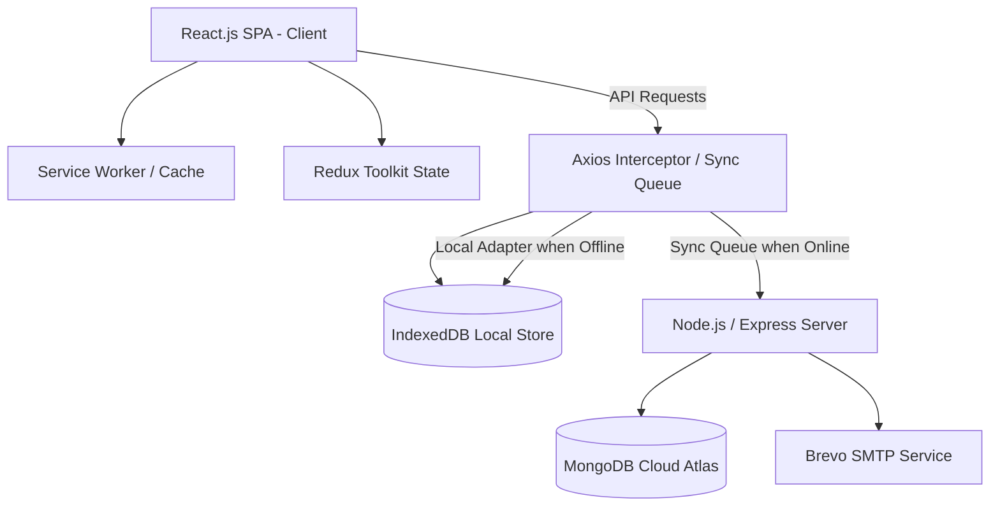

# PROJECT DOCUMENTATION & REPORT

**PROJECT TITLE:** `todo.` — A Premium Offline-First MERN Stack Task Management System
**SUBMISSION PURPOSE:** Academic College Project Report
**DEVELOPER:** Dev Kant Kumar
**TECHNOLOGY STACK:** MongoDB, Express.js, React.js, Node.js (MERN), Redux Toolkit, Tailwind CSS, Service Workers (PWA), IndexedDB, Brevo API

---

## 1. Executive Summary & Project Abstract

The `todo.` application is a modern, responsive, and highly secure task management system designed to bridge the gap between traditional list-making utilities and premium productivity platforms. Unlike standard task managers that fail under unstable network conditions, `todo.` implements an advanced, custom **Offline-First Synchronization Engine** leveraging browser IndexedDB caching, Axios request interception, and transactional queue reconciliation.

To encourage long-term user retention, the application integrates gamified productivity feedback loops, including:
1. A **Duolingo-style Daily Streak System** with a built-in grace window to prevent demotivation.
2. A **GitHub-inspired 365-day Activity Heatmap** visualizing task completions.
3. Interactive milestone badge notifications.

Built on the robust MERN stack, the application ensures security through **JWT token authentication**, **bcrypt password hashing**, **express-rate-limiting**, **Helmet HTTP headers**, and **dual-phase OTP validation** for registration, password recovery, and account deletions. The user interface features glassmorphic design elements, custom dynamic SVG illustrations matching the time of day, and fluid transitions powered by Framer Motion.

---

## 2. Problem Statement & Project Objectives

### 2.1 Problem Statement
Modern web applications heavily rely on persistent cloud connectivity. When network coverage degrades or drops entirely:
- Standard single-page applications (SPAs) crash, lock up, or fail to persist user inputs, leading to data loss.
- High network latency degrades UX, rendering applications sluggish.
- Lack of motivational cues and positive reinforcement triggers user drop-off.

### 2.2 Project Objectives
- **Offline-First Resilience**: Enable full creation, modification, deletion, and categorization of tasks without active internet access.
- **Data Integrity & Reconciliation**: Implement a chronological synchronization queue to resolve differences between local state and the remote MongoDB cloud database when reconnection occurs.
- **Engagement & Productivity Mechanics**: Motivate users through streak metrics, milestone badge awards, and contribution charts.
- **End-to-End Security**: Shield endpoints against injection, brute-forcing, and credential leaks. Protect accounts via automated Brevo SMTP OTP email dispatches.
- **High-End UI/UX Design**: Construct a responsive, screen-adaptive layout with clean themes, dynamic greetings, and micro-interactions.

---

## 3. System Architecture & Tech Stack



### 3.1 Technology Stack Details

#### Frontend (Client Side)
*   **React.js (Vite)**: Modern component architecture, rendering loops, and fast hot module replacement (HMR).
*   **Redux Toolkit (RTK)**: Centralized state management for user authentication, todo filtering, loading indicators, and optimistic streak updates.
*   **Tailwind CSS**: Utility-first CSS framework for clean layouts, responsive grid configurations, and theme integrations.
*   **Framer Motion**: Hardware-accelerated transitions, interactive drawer animations, and layout morphing.
*   **IndexedDB**: Low-level browser API storing tasks, contribution maps, system configurations, and local queues.
*   **Service Workers**: Asset caching for offline shell loads and background task notifications.

#### Backend (Server Side)
*   **Node.js & Express.js**: Asynchronous event-driven backend handling REST API endpoints.
*   **Mongoose ODM**: Strongly-typed schemas for MongoDB validation.
*   **Helmet & CORS**: Hardening HTTP headers and defining explicit allowed domains.
*   **Express Rate Limit**: Brute-force prevention limiting endpoint access (configured to 300 requests per 15 minutes to accommodate SPA polling).
*   **Morgan Logging**: Detailed console output and persistent file logging (`server.log`) for system audits.

#### Database & Third-Party Services
*   **MongoDB Cloud Atlas**: Cloud-hosted document-based NoSQL database.
*   **Brevo API**: Transactional mail server API dispatched via HTTPS endpoints using native `fetch` to handle account activations, password resets, and deletions.

---

## 4. Feature Breakdown & Implementation

### 4.1 Authentication & User Lifecycle
Accounts transition through several verified states:
1.  **Registration**: User registers with name, username, email, and password. An entry is created in MongoDB with `isVerified: false`. A cryptographically secure 6-digit OTP is generated, set to expire in 15 minutes, and emailed to the user via Brevo SMTP.
2.  **Activation**: The user enters the OTP, setting `isVerified: true` and clearing OTP fields. Only verified accounts can access task filters and sync streams.
3.  **Password Recovery**: If forgotten, users request a reset OTP. Providing the correct OTP grants access to change the password.
4.  **Account Deletion**: To prevent accidental deletion, users must trigger a deletion request, verify an OTP sent to their email, and confirm execution. Upon validation, the account, todos, and streak records are scrubbed.

### 4.2 Task Management (CRUD)
*   **Fields**: Tasks maintain parameters like Priority (`low`, `medium`, `high`), Due Date, Detailed Description, Starred Flag, and Deleted Flag.
*   **Soft Deletion**: Deleting a task sets its `deleted` property to `true`. Soft-deleted tasks are visible in the "Trash" filter for 15 days, allowing the user to restore them. After 15 days, they are pruned.
*   **Task Reordering**: The system tracks `rankIndex` allowing drag-and-drop or logical re-ranking of lists.

### 4.3 custom Offline-First Synchronization Engine
The sync architecture represents the key technical achievement of the project:
1.  **Axios Interceptor**: Outgoing API requests are intercepted. If the browser is offline (`navigator.onLine === false`), the interceptor blocks the HTTP connection and routes the operations directly to `handleOfflineWrite()` or `handleOfflineRead()`.
2.  **Local Cache (IndexedDB)**: Read requests return cached records directly from IndexedDB (e.g. `filters/all`, `filters/counts`, and `filters/activity`), ensuring instant loads without network.
3.  **Sync Queueing & Temporary IDs**:
    *   When a new task is created offline, the engine generates a temporary identifier (e.g., `temp_171924...`) and writes the task to IndexedDB.
    *   The creation payload is added to a chronological "offline write queue" in IndexedDB.
    *   Subsequent actions on this task (e.g., starring it, editing the title) reference the `temp_` ID and add corresponding updates to the queue.
4.  **Conflict Resolution (ID Mapping)**:
    *   When connectivity returns, the queue synchronizes sequentially.
    *   The `addTask` request runs first. The server creates the MongoDB document and returns a real database `ObjectId`.
    *   The frontend maps `tempId` to `realId` in a lookup table (`tempIdMap`).
    *   Before sending downstream queue updates (e.g., starring the task), the engine rewrites their payload parameters, replacing `temp_` IDs with the correct database `ObjectId`. This avoids database `CastError` exceptions.
5.  **Recovery Polling**: When offline, a background timer pings the server count endpoint every 10 seconds. On success, the connection status is set back to online, triggering immediate queue dispatch.

### 4.4 Gamified Streak & Heatmap Engine
*   **Daily Streaks**: Calculated by checking consecutive calendar days backwards from today. The engine grants a **one-day grace window**: if a user hasn't completed a task today, the streak remains intact if yesterday was active.
*   **Heatmap Grid**: Standard 365-day grid visualizing completed tasks. Completed tasks increment a calendar day's completion count in `StreakEntries`. Deletions do not rewrite this calendar history, separating productivity stats from the task lifecycle.
*   **Milestones**: Users earn badges for streaks of 3 days (Starter Spark), 7 days (Week Warrior), 14 days (Fortnight Force), 30 days (Monthly Master), 100 days (Century Centurion), and 365 days (Legendary).

### 4.5 Responsive Aesthetics & Dynamic Illustrative UX
*   **Glassmorphism**: UI blocks feature borders like `border-zinc-900/60`, backdrops like `backdrop-blur-xl`, and backgrounds like `bg-[#0e0e11]/85`.
*   **Dynamic Visuals**: The main greeting panel renders custom animated SVG illustrations that change based on local time:
    *   *05:00 - 11:59*: Morning Sun & Sky.
    *   *12:00 - 16:59*: Afternoon Orbiting Orange Sun.
    *   *17:00 - 21:59*: Evening Pink Horizon.
    *   *22:00 - 04:59*: Night Sky with Twinkling Stars and Crescent Moon.

---

## 5. Database Schema Design

The application utilizes three core models defined in Mongoose.

### 5.1 User Model (`userModel.js`)
Stores authenticated user credentials, verification flags, and temporary OTPs.

| Field Name | Type | Constraints | Description |
| :--- | :--- | :--- | :--- |
| `name` | String | Required | Display name of the user. |
| `username` | String | Required, Unique | Unique handle for login and search. |
| `email` | String | Required, Unique | Email address (target for OTP transmissions). |
| `password` | String | Required | Bcrypt-hashed password. |
| `date` | String | Required | Date the account was registered. |
| `isVerified` | Boolean | Default: `false` | Block toggle. True only after email OTP validation. |
| `otp` | String | Optional | 6-digit hashed string for account validation. |
| `otpExpires` | Date | Optional | Expiration timestamp of registration OTP. |
| `resetPasswordOtp` | String | Optional | 6-digit verification code to reset credentials. |
| `resetPasswordOtpExpires` | Date | Optional | Expiration of password reset code. |
| `deleteAccountOtp` | String | Optional | OTP required to finalize deletion requests. |
| `deleteAccountOtpExpires`| Date | Optional | Expiration of deletion token. |

### 5.2 Todo Model (`todoModel.js`)
Captures all parameters of individual task items.

| Field Name | Type | Constraints | Description |
| :--- | :--- | :--- | :--- |
| `userId` | String | Required, Indexed | Points to the owner's `user` document ID. |
| `task` | String | Required | The text title of the task. |
| `completed` | Boolean | Required | Toggled completion status. |
| `starred` | Boolean | Required | Highlights important tasks. |
| `deleted` | Boolean | Required | Soft deletion toggle (trashed filter state). |
| `date` | Date | Required | Creation timestamp. |
| `priority` | String | Enum: `['low', 'medium', 'high']` | Priority tier (Default: `low`). |
| `dueDate` | Date | Optional | Deadline for background notifications. |
| `description` | String | Optional | Additional notes/details. |
| `completedAt` | Date | Default: `null` | Exact time the task was completed. |
| `rankIndex` | Number | Default: `0` | Order index for sorting. |
| `startDate` | Date | Default: `null` | Scheduled start date. |
| `endDate` | Date | Default: `null` | Projected completion date. |

### 5.3 Streak Entry Model (`streakModel.js`)
Acts as an immutable daily productivity log to record historical progress.

| Field Name | Type | Constraints | Description |
| :--- | :--- | :--- | :--- |
| `userId` | String | Required, Indexed | Reference user ID. |
| `dateKey` | String | Required, RegEx: `YYYY-MM-DD` | Date key representing a specific calendar day. |
| `count` | Number | Required, Default: `0`, Min: `0` | Tasks completed (net of unmarking) on this day. |

*   **Compound Index**: An index is declared on `{ userId: 1, dateKey: 1 }` with `{ unique: true }`. This guarantees a user has exactly one streak document per calendar day, avoiding race conditions during fast task completions.

---

## 6. API Reference (Rest Endpoints)

All endpoints (except auth setup) require authentication via JWT passed through the `X-Authorization` header as `Bearer <token>`.

### 6.1 Authentication Endpoints (`userRoutes.js`)
*   `POST /user/register`: Registers a new user. Triggers a welcome/verification email with a 6-digit OTP.
*   `POST /user/verifyOtp`: Validates the registration OTP. Sets account `isVerified: true`.
*   `POST /user/signin`: Validates credentials. Returns user metadata and a JWT.
*   `POST /user/forgotPassword`: Generates a recovery OTP and emails it.
*   `POST /user/resetPassword`: Takes the recovery OTP and replaces the hashed password.
*   `POST /user/sendDeleteAccountOtp`: Generates account removal confirmation OTP.
*   `POST /user/deleteAccount`: Confirms the delete OTP and drops all user tables.

### 6.2 Task Modification Endpoints (`todoRoutes.js`)
*   `POST /todo/addTask`: Accepts task parameters and writes to the DB.
*   `POST /todo/updateTask`: Modifies task values (priority, dueDate, description, completed, starred). Adjusts streaks.
*   `POST /todo/markComplete` / `unMarkComplete`: Toggles completions. Updates `completedAt` and adjusts streak logs.
*   `POST /todo/markStarred` / `unMarkStarred`: Toggles starring priority.
*   `POST /todo/deleteTask` / `undoDelete`: Flags soft-deletes or restores them.
*   `POST /todo/deleteall`: Permanently deletes all soft-deleted tasks in the Trash.

### 6.3 Task Filtering Endpoints (`todoFiltersRoutes.js`)
*   `POST /filters/all`: Returns all active tasks (`deleted: false`).
*   `POST /filters/completed`: Returns all completed tasks (`completed: true, deleted: false`).
*   `POST /filters/starred`: Returns all starred tasks (`starred: true, deleted: false`).
*   `POST /filters/today`: Returns tasks scheduled/created today.
*   `POST /filters/week`: Returns tasks created within the last 7 days.
*   `POST /filters/deleted`: Returns soft-deleted tasks in the Trash.
*   `POST /filters/counts`: Returns current counts of tasks across all filters.
*   `POST /filters/activity`: Returns the complete user task completion heatmap map.

---

## 7. Security and Optimization Mechanisms

### 7.1 Security Hardening
1.  **JWT Authentication**: Session tokens are signed using a server-side secret key and verify user identity statelessly.
2.  **Rate Limiting**: Configured to restrict brute-forcing attacks on API endpoints (e.g. login attempts, OTP entry).
3.  **Helmet**: Injects security-focused headers, blocking XSS (Cross-Site Scripting) and clickjacking.
4.  **CORS Filters**: Configured to allow requests strictly from the web client domains (both local development ports and production domains).
5.  **Bcrypt Hashing**: Password strings are salted and hashed on registration, protecting credentials in case of a database leak.

### 7.2 Performance & UI Enhancements
1.  **Optimistic UI Updates**: When toggling completion, React components update immediately. The app doesn't block interaction waiting for the server's API response, ensuring a fast feel.
2.  **Asset Caching**: Service workers cache Vite-built bundles, static assets, and SVG drawings locally, enabling instant offline app boots.
3.  **Tailored Indexes**: Unique indexing structures on `streakModel` (`userId` + `dateKey`) prevent duplicate write transactions when marking tasks complete in rapid succession.

---

## 8. Deployment & Execution Guide

### 8.1 Environment Variables Configuration

#### Backend `.env`
Create a `.env` file in the root of the `backend` folder:
```ini
PORT=5000
MONGO_URI=mongodb+srv://<username>:<password>@cluster0.mongodb.net/todo_db
JWT_SECRET=your_super_secure_jwt_secret_key
NODE_ENV=development
BREVO_API_KEY=xkeysib-your_brevo_api_key_here
SENDER_EMAIL=no-reply@todo.yourdomain.com
SENDER_NAME="todo."
```

#### Frontend `.env`
Create a `.env` file in the root of the `frontend` folder:
```ini
VITE_API_BASE_URL=http://localhost:5000/
```

### 8.2 Installation & Running Locally

1.  **Clone and Navigate**:
    ```bash
    git clone https://github.com/dev-kant-kumar/To-Do.git
    cd To-Do
    ```
2.  **Install Node Modules**:
    ```bash
    # Install backend dependencies
    cd backend && npm install
    # Install frontend dependencies
    cd ../frontend && npm install
    ```
3.  **Start Development Environment**:
    *   **Backend**: Run `npm run start` or `node index.js` inside the `backend/` directory.
    *   **Frontend**: Run `npm run dev` inside the `frontend/` directory.
    *   Open `http://localhost:5173` (or the port specified by Vite) in your browser.

---

## 9. Conclusion & Future Enhancements

The `todo.` project successfully implements a modern MERN task management application featuring a robust custom offline synchronization architecture. By prioritising data integrity during unstable network states and combining it with engaging gamified elements (daily streaks, activity heatmaps, milestone indicators), the system stands out as a highly practical utility.

### Future Scope
*   **Subtask Hierarchies**: Allowing users to break down larger tasks into smaller checkable checklists.
*   **Collaboration & Team Spaces**: Shared task boards where users can assign todos to team members.
*   **OAuth2 Integrations**: Google/GitHub social logins.
*   **Machine Learning Smart Ordering**: Automating list prioritisation based on user history, deadlines, and completion patterns.
